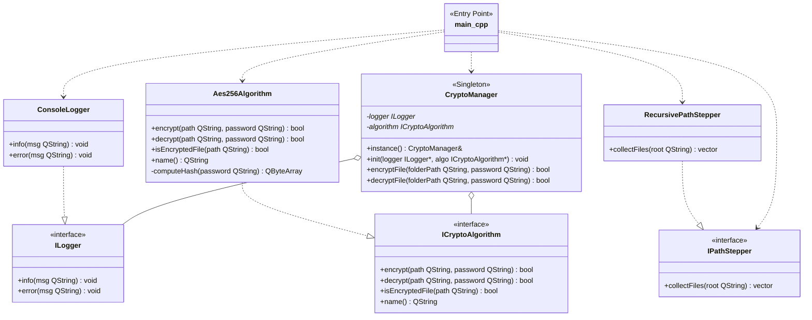

# CryptoManager

Консольное приложение на **Qt5** для шифрования файлов и папок с использованием библиотеки **Crypto++**.

---
## 📖 Описание

Приложение позволяет:
- Шифровать отдельные файлы и целые директории рекурсивно
- Дешифровать файлы с проверкой ключа через хеш
- Защищаться от повторного шифрования уже зашифрованных файлов
- Сохранять оригинальные расширения файлов
- Выводить логирование через `ConsoleLogger` с поддержкой UTF-8

**Алгоритм**: `AES-256-CBC` с `SHA-256` для хеширования ключа и `PKCS#7` паддингом.

---

## Формат шифрования

Каждый зашифрованный файл имеет следующую структуру:

```
┌─────────────────────────────────┐
│ 4 байта: MAGIC = "ENC!"         │ ← Маркер зашифрованного файла
├─────────────────────────────────┤
│ 32 байта: SHA-256(password)     │ ← Хеш ключа для проверки
├─────────────────────────────────┤
│ 16 байт: IV (вектор инициализ.) │ ← Случайный для каждого файла
├─────────────────────────────────┤
│ Переменная: зашифрованные данные│ ← AES-256-CBC + PKCS#7
└─────────────────────────────────┘
```

### 🔍 Проверка ключа при расшифровке:
1. Читается заголовок файла (4 + 32 + 16 байт)
2. Вычисляется `SHA-256(введённый_пароль)`
3. Сравнивается с сохранённым хешем
4. **Если не совпадает** → операция прерывается, файл не изменяется

Это защищает от повреждения данных при попытке расшифровки неверным паролем.

---

## UML-диаграмма классов


## Сборка

### Требования
- Qt 5.15+ (`core`, `testlib`)
- Crypto++ 8.x (`libcryptopp-dev`)
- C++17-совместимый компилятор (GCC 9+, Clang 10+)

### Через Qt Creator
1. Откройте файл `.pro`
2. Выберите конфигурацию `Desktop Qt 5.x GCC 64bit Debug`
3. `Ctrl + B` → собрать

### Через терминал
```bash
# Установка зависимостей (Ubuntu/Debian)
sudo apt install qtbase5-dev libqt5test5-dev libcryptopp-dev

# Сборка
qmake project.pro
make -j$(nproc)

# Сборка с тестами
qmake project.pro "CONFIG+=build_tests"
make clean && make -j$(nproc)
```

---

## Использование

```bash
# Шифрование файла или папки
./crypto_app encrypt /path/to/target "mySecretPassword"

# Дешифрование
./crypto_app decrypt /path/to/target "mySecretPassword"
```

### Параметры
| Аргумент | Описание |
|----------|----------|
| `<path>` | Путь к файлу или директории |
| `<mode>` | `encrypt` или `decrypt` |
| `<password>` | Пароль для шифрования/дешифрования |

### Примеры
```bash
# Зашифровать папку с проектом
./crypto_app encrypt ~/Documents/project "P@ssw0rd!"

# Расшифровать с проверкой ключа
./crypto_app decrypt ~/Documents/project "P@ssw0rd!"

# Попытка расшифровки неверным паролем (файл не изменится)
./crypto_app decrypt ~/Documents/project "wrong_password"
```

### Логирование
```
[INFO] Processing 5 file(s) with algorithm: AES-256-CBC
[INFO] Encryption successful: /path/to/file.txt
[ERROR] File is already encrypted. Re-encryption prohibited: /path/to/encrypted.txt
[ERROR] Decryption failed (wrong key or corrupt data): /path/to/file.txt
```

---

## Тестирование

### Unit-тесты (Qt Test)

#### Запуск
```bash
# Сборка тестов
qmake project.pro "CONFIG+=build_tests"
make clean && make

# Запуск
./crypto_tests -v2
```


### Ручное тестирование

| № | Сценарий | Входные данные | Ожидаемый результат | Команда |
|---|----------|----------------|---------------------|---------|
| 1 | Шифрование одного файла | Папка с 1 файлом, режим `encrypt`, пароль `123` | Файл зашифрован, начинается с `ENC!` | `./crypto_app encrypt ../testing/one_file_dir 123` |
| 2 | Шифрование вложенных папок | Папка с подпапками, режим `encrypt` | Все файлы рекурсивно зашифрованы | `./crypto_app encrypt ../testing/ 123` |
| 3 | Дешифрование одного файла | Зашифрованный файл, верный пароль | Файл восстановлен, идентичен оригиналу | `encrypt → decrypt` с одним паролем |
| 4 | Дешифрование вложенных папок | Зашифрованная структура, верный пароль | Все файлы восстановлены | `encrypt ../testing/ → decrypt ../testing/` |
| 5 | Блокировка повторного шифрования | Уже зашифрованный файл, режим `encrypt` | Ошибка: `File is already encrypted` | Дважды `encrypt` с одним паролем |
| 6 | Защита от дешифрования обычного файла | Не зашифрованный файл, режим `decrypt` | Ошибка: `File is not encrypted` | `./crypto_app decrypt plain.txt 123` |
| 7 | Пустая директория | Пустая папка, режим `encrypt` | Сообщение: `Directory is empty`, выход 0 | `./crypto_app encrypt ../empty/ 123` |
| 8 | Несуществующий путь (шифрование) | `/tmp/missing`, режим `encrypt` | Ошибка: `Path does not exist` | `./crypto_app encrypt /tmp/missing 123` |
| 9 | Несуществующий путь (дешифрование) | `/tmp/missing`, режим `decrypt` | Ошибка: `Path does not exist` | `./crypto_app decrypt /tmp/missing 123` |
| 10 | Отсутствие пути в аргументах | Только режим `decrypt` | Ошибка: `Invalid arguments` | `./crypto_app decrypt` |
| 11 | Отсутствие всех аргументов | Запуск без параметров | Ошибка: `Usage: ...` | `./crypto_app` |
| 12 | Некорректный режим | Режим `шифр` вместо `encrypt` | Ошибка: `Invalid mode` | `./crypto_app шифр ../testing/ 123` |
| 13 | Неверный пароль при дешифровании | Зашифрованный файл, пароль `1234` вместо `123` | Ошибка: `wrong key`, файл не изменён | `encrypt 123 → decrypt 1234` |
| 14 | Пропуск ярлыков (Windows) | Папка с файлом и `.lnk`, режим `encrypt` | Ярлык не обрабатывается, файл зашифрован | `./crypto_app encrypt ../with_link/ 123` |
| 15 | Пропуск системных файлов | Папка с текстовыми и системными файлами | Шифруются только текстовые файлы | `./crypto_app encrypt ../mixed/ 123` |
